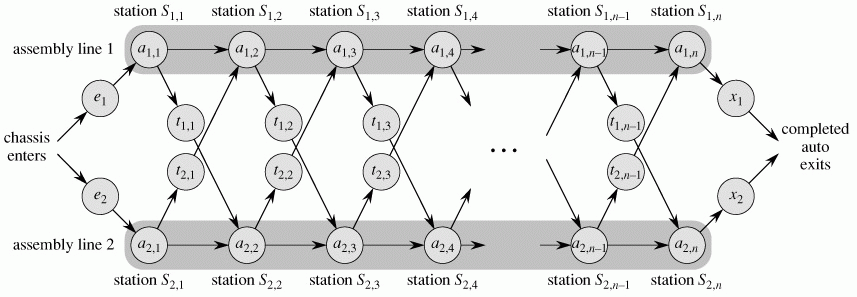
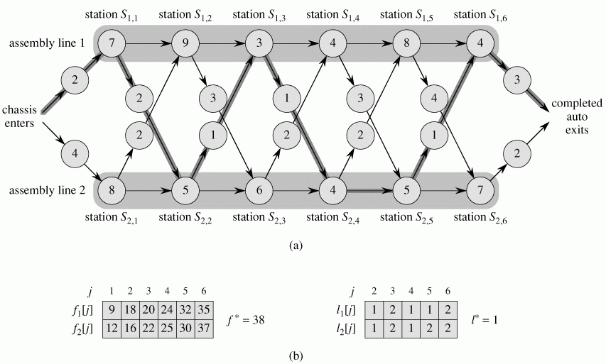
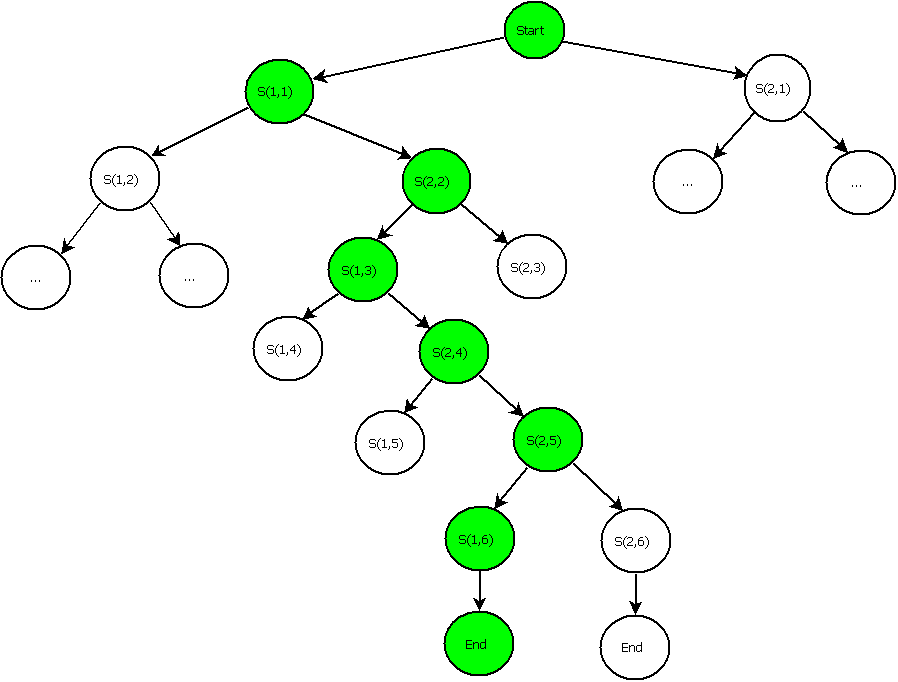

# 装配线与工作站问题（穷举）
## 算法分析

题目：
汽车公司在有两条装配线的工厂内生产汽车，一个汽车底盘在进入每一条装配线后，在每个工作站会在汽车底盘上安装不同的部件，最后完成的汽车从装配线的末端离开

每一条装配线上有 n 个工作站，编号为 j=1、2、…、n，把装配线 i（i 为 1 或 2）的第 j 个工作站表示为 S(i，j)。装配线 1 的第 j 个工作站 S(1，j) 和装配线 2 的第 j 个工作站 S(2，j) 执行相同的功能，然而这些工作站是在不同的时间建造的，并且采用了不同的技术，因此，每个工作站上完成装配所需要的时间也不相同，即使是在两条装配线相同位置的工作站也是这样。把每个工作站上所需要的装配时间记为 a(i，j)，并且，底盘进入装配线 i 需要的时间为 e(i)，离开装配线 i 需要的时间是 x(i)。正常情况下，底盘从一条装配线的上一个工作站移到下一个工作站所花费的时间可以忽略，但是偶尔也会将未完成的底盘从一条装配线的一个工作站移到另一条装配线的下一个工作站，比如遇到紧急订单的时候。假设将已经通过工作站 S(i，j) 的底盘从装配线 i 移走所花费的时间为 t(i，j)，现在的问题是要确定在装配线 1 内选择哪些工作站以及在装配线 2 内选择哪些工作站，以使汽车通过工厂的总时间最小，如图（2）所示，最快的时间是选择装配线1的 1、3 和 6 号工作站以及装配线 2 的 2、4 和 5 号工作站。


`简单理解一下这个题目的意思就是汽车底盘选择一条装配线，期间不能更换，从第一个工作站移动到最后一个工作站，即可完成安装，但是根据对题目的理解，这样所花费的时间肯定不是最短的。如果另一条装配线上的某个工作站效率比较高，那么装配到这一步的时候，换到那条装配线上进行装配肯定会节省时间，但是考虑到从一条装配线移动到另一条装配线也需要花费时间，那就要综合考虑了。“移”还是“不移”？这是个问题。`

题的解空间是底盘在各个工作站上装配和移动的过程记录，根据这个过程记录，很容易计算出实际的装配时间。

产生一个移动过程记录的关键点是“移动”这个动作。根据题意，每次“移动”会有两个可能的结果，其一是在本生产线上继续移动到下一个工作站，另一个是移动到另一条装配线上的下一个工作站。显然，我们的移动过程记录是树形结构，每次移动产生两个分支，如图（3）所示，最终的结果就是和一棵二叉树一样的结构，从根节点到任何一个叶子节点就是一个移动过程。我们的穷举过程就是对每个移动过程来计算花费的时间，然后比较时间，找出花费时间最短的移动过程。



对树形空间遍历，最好的策略就是使用递归的方法进行穷举。考虑到解空间规模比较大，如果采用先穷举搜索得到全部的解空间，然后再逐个计算装配时间并比较时间的方法，就需要一个很大的存储空间，当问题规模比较大时，有可能超出系统存储能力的限制。为了避免这个问题，算法在遍历的过程中，*应该找到一个完整的装配过程后就立即与当前已知最小值进行比较，如果这个结果已经不是最优解，则不存储当前结果，然后回溯到上一个位置，继续遍历。如果这个结果比当前最小值还要小，则记录这个结果，并更新当前已知最小值，然后再回溯。*

## 准备数据模型

算法给出的时间开销参数有四种：
* 每个工作站的装配时间
* 每个工作站转移到另一条装配线的转移时间
* 进入装配线时间
* 离开装配线时间

```
typedef struct 
{
    int assemble_time[LINES][STATIONS];
    int transport_time[LINES][STATIONS];
    int enter_time[LINES];
    int exit_time[LINES];
}Program_T;
```

前面算法策略提到，穷举遍历不保存全部结果，但是需要保存当前正在搜索的一个结果和当前已知的最优结果。根据题目要求，算法的结果输出除了装配时间，还要包含底盘在各个工作站的转移记录。所以，每个结果应包含两个属性，一个是装配时间，另一个是转移记录。遍历结果的数据结构定义如下

```
typedef struct
{
    int line[STATIONS];  //遍历过程中的当前结果记录
    int fs;
    int fline[STATIONS];  //当前已知的最优结果
    int ffs;
}Result_T;
```
转移记录用一个一维数组表示，表示每个工作站所在的装配线，比如 line[3] 存放的就是第 4 个工作站所在的装配线（工作站和装配线的编号都是从 0 开始，便于数组操作）。ffs 和 fline 存放当前已知的最优结果，当整个搜索遍历完成后，它们就是最终结果。

## 穷举算法设计

**有递归的地方就有回溯**，树形结构的遍历使用递归法最简单，用递归法设计算法的关键是找到递归主体和递归退出条件，递归主体可以认为是一个子结构，所有的子结构都可以用同一套方法进行处理，子结构的区别仅仅在于层次或位置不同。递归不能无限制进行，必须在合适的地方退出，以便进行回溯处理。**设计递归算法，递归主体明确了，算法也就实现了**

递归主体：假如底盘当前的位置在第 i 条装配线上的第 j 个工作站，则底盘可以采用以下两种方式移动：

* 移动到第i条装配线上的第 j+1 个工作站
* 移动到第（i + 1）% 2 条装配线上的第 j + 1 个工作站，需要记录转移装配线的开销

其中，（(i+1)%2 的意义就是当 i 是 0 的时候，转到 1 号装配线，当 i 是 1 的时候，转到 0 号装配线）。

