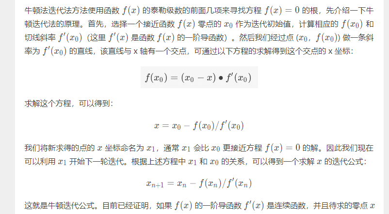
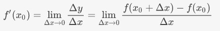
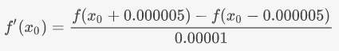

# 第2-1课：非线性方程与牛顿迭代法

## 代数法求解低阶非线方程
用代数方法求一元非线性方程的解的方法有 `开平方法`、`配方法`、`因式分解法`、`公式法`等

近似求解的方法有`作图法`以及各种`迭代法`。

**代数法** 求解方程虽然`准确性好`、`精度高`，但是`不利于编制计算机程序`，所以在数值分析领域，常用各种 **迭代法** 求解一元非线性方程。迭代法方法`简单`，`适合计算机`求解，甚至可以被固化到硬件芯片中，计算`效率`并不比代数法差。常用的求解一元非线性方程的方法有`二分逼近法`和`牛顿迭代法`

### 二分逼近法
二分逼近法的数学原理: 对于实属域的函数 f(x) ，如果存在实数 k ，使得 f(x) = 0,则 x = k 就是函数 f(x) 的零点。如果函数 f(x) 在是连续函数，且在区间[a,b]上是单调函数，只要 f(a)和 f(b) 异号，就说明在区间[a,b]中一定有零点，此时就可以使用二分逼近法近似的找到这个零点。

假设在上述区间上：`f(a) < 0` ,`f(b) > 0`,则可按照以下过程实施二分逼近法：

1. 如果 f((a + b ) / 2 ) = 0,则 (a + b)/2 就是零点
2. 如果 f(a) . f((a + b) / 2) < 0,则零点在区间 [a,(a + b)/2] 上，令 b = (a + b) / 2,继续从第一步开始判断
3. 如果 f(a) . f((a + b) / 2) > 0,则零点在区间 [(a + b)/2,b] 上，令 a = (a + b) / 2,继续从第一步开始判断 

`从上述过程可以看到，每次运算之后，区间范围就缩小一半，呈现线性收敛速度。由以上分析可知，数学意义上的二分逼近法可以采用迭代法的思想设计算法实现。`

#### 二分逼近法算法实现
*二分逼近法就是和二分查找一个思路的算法，每次丢弃一半的错误数据，再从另一半寻找答案，我还以为直接可以用公式算出来呢*
代法的三个要点:
* 它们分别是迭代变量
* 迭代递推关系公式
* 迭代终止条件

一般情况下，**迭代变量** 就是计算结果 `x` ，但是二分逼近法的迭代关系式不是计算结果`x`的迭代关系，而是逼近区间[a,b]的关系，所以这个算法的迭代变量就是表示区间范围的 a 和 b 两个变量。**迭代递推关系** ，其递推关系公式就是前面描述的实施过程中的 2 和 3 两部给出的 a和b两个量的递推更新计算方法

迭代退出条件，退出条件 *就是 f((a + b ) / 2) = 0*  .但是因为浮点数精度高，在计算机系统中直接按照 `f((a + b) /2 ) = 0` 判断很难。有时候进行很多次迭代也无法满足这个条件，更何况由于数据存储方式的原因，计算机无法对两个浮点数直接做相等的判断，通常只要 f((a+b)/2)f((a+b)/2) 在精度允许的范围内逼近 0 时就可以结束二分逼近过程，将 (a+b)/2(a+b)/2 作为零点，在精度和计算速度二者之间取折中。除了判断 f((a+b)/2)f((a+b)/2) 的值，还可以根据 *区间 [a, b][a,b] 的大小确定结束条件*，在精度允许的范围内，只要区间范围小于精度阈值，也可以直接取 (a+b)/2(a+b)/2 作为零点

#### 局限性
二分法的局限性就是不能计算复根和重根，需要借助其手段确定零点所在区间

除了求解非线性方程，二分逼近法还可以用来求解平方根（或 n 次方根），对于 x^2=n，只需将其转化为方程 f(x) = x^2 - n，就可以将求平方根转化成求这个方程的解。

### 牛顿迭代法
**使用函数 f(x)f(x) 的泰勒级数的前面几项来寻找方程 f(x) = 0f(x)=0 的根**

**原理**：
首先，选择一个接近函数 f(x) 零点的 x_0作为迭代初始值，计算相应的 f(x_{0})和切线斜率 f'(x_{0})这里 f'(x) 是函数 f(x)的一阶导函数）。然后我们经过点 (x_{0}，f(x_{0}) 做一条斜率为 f'(x_{0})的直线，该直线与 x 轴有一个交点，可通过以下方程的求解得到这个交点的 x 坐标：

求解这个方程，可以得到：
x = x_{0} - f(x_{0})/f'(x_{0}) 

新求得的点的 xx 坐标命名为 x_{1}
​	 ，通常 x_{1}会比 x_{0}更接近方程 f(x) = 0f(x)=0 的解。因此我们现在可以利用 x_{1}  开始下一轮迭代。根据上述方程中 x_{1}和 x_{0}的关系，可以得到一个求解 xx 的迭代公式：

x_{n+1} = x_{n} - f(x_{n})/f'(x_{n})

#### 导函数的求解与近似公式
牛顿迭代公式中需要计算函数的导数，直接根据原函数推出一阶导函数，然后计算导函数的值有点困难，一般都是利用导数的数学原理，使用近似公式直接求函数在某一点的导数。导数的数学定义是：当函数 y = f(x)y=f(x) 的自变量 xx 在一点 x_{0}上产生一个增量 ΔxΔx 时，函数输出值的增量 Δy 与自变量增量 Δx 的比值在 ΔxΔx 趋于 0 时的极限值。如果这个极限值存在，则这个值就是 f(x)在 x_{0}处的导数，记做 f'(x_{0})。用公式定义即为：

极限是在无穷小或无穷大的尺度上考察函数的一些特性，在计算机上无法表达无穷小和无穷大，只能在数据能表达的合法范围内，在满足计算精度的情况下通过最小值来近似模拟。如果无法精确计算导数 f'(x_{0})，我们仍然采用近似计算方法得到一个满足精度的模拟值。根据导数的数学定义，如果不考虑极限，这个值就是 Δy/ΔxΔy/Δx 的值，在 x_{0}附近一个非常小的尺度上选择 ΔΔ，可以得到近似的导数值。我们选择按照以下近似公式计算导数值：

计算函数 f 在 xx 附近的一阶导数值的算法可定义为：

      double CalcDerivative(FunctionPtr f, double x)
      {
          return (f(x + 0.000005) - f(x - 0.000005)) / 0.00001;
      }

#### 牛顿迭代法算法实现
